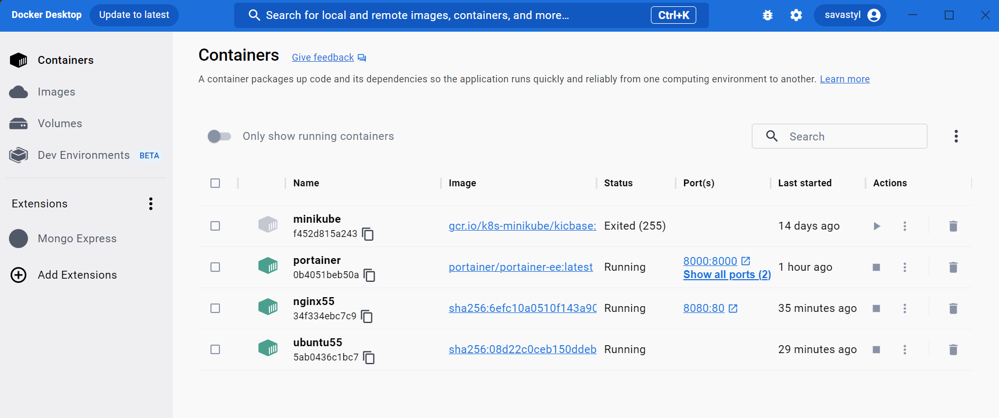

# Deploying and Managing Containers with Terraform and Portainer

This guide will walk you through the process of deploying and managing Docker containers using Terraform and Portainer.

### Portainer Portal View

### Docker Desktop View

## Prerequisites
Before getting started, you will need to have the following installed on your system:

+ Docker
+ Terraform
+ Portainer

## Usage
+ Clone this repository to your local machine.
+ Navigate to the directory where the cloned repository is located.
+ Open the .tf files and make any necessary modifications to the Docker container configurations. In this example, we have included configurations for two containers: nginx and webserver.

+ To access the Nginx container, open your browser and navigate to http://localhost:8080. You should see the Nginx welcome page.

+ Run `terraform init` to initialize the Terraform provider and download any necessary plugins.
+ Run `terraform apply` to deploy the Docker containers.
+ Open Portainer and navigate to the "Containers" section to manage your containers.

## Terraform Configuration
The .tf files contain the Terraform configuration for deploying the Docker containers. The following resources are defined:

+ `docker_image.nginx`: This resource defines the nginx Docker image to use for the nginx container.
+ `docker_container.nginx`: This resource defines the nginx container, using the nginx image and exposing port 8080 to the host machine.
+ `docker_image.ubuntu`: This resource defines the ubuntu Docker image to use for the webserver container.
+ `docker_container.webserver`: This resource defines the webserver container, using the ubuntu image and exposing all ports to the host machine.

## Conclusion
To deploy and manage Docker containers using Terraform and Portainer. By using these tools together, you can easily deploy and manage containers at scale with ease.

